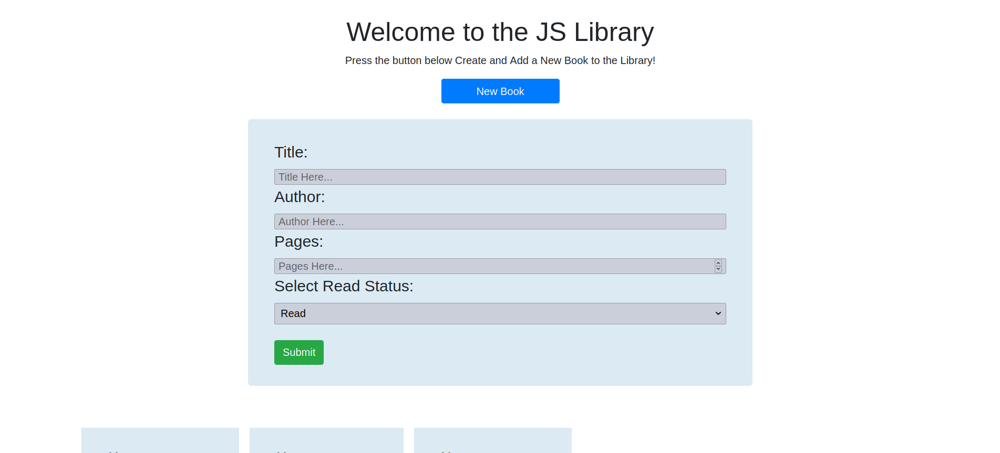
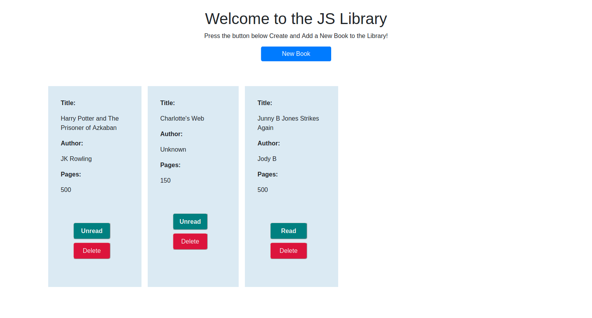

# JS Library
This is a practice project for Javascript where we will be building a Library with Book objects. 

<!-- TABLE OF CONTENTS -->
## Table of Contents
- [JS Library](#js-library)
  - [Table of Contents](#table-of-contents)
- [About The Project](#about-the-project)
  - [Installation](#installation)
  - [Live View:](#live-view)
- [Authors](#authors)
- [Acknowledgements](#acknowledgements)
- [Show your support](#show-your-support)
<!-- ABOUT THE PROJECT -->
# About The Project
This is a practice project for Javascript where we will be building a Library with Book objects.

You can Create a New Book Object by using the New Book Button, which will display a form to insert the book Title, Author and Pages and then clicking submit, which will pass the inputs of the form and save them into a new Book Object.

You can Update the Book's status from Read to Unread and visceversa by just pressing the status button that corresponds to each book.

Lastly, you can remove a book from the Library. This will also remove the book from local storage.

## Installation
* Clone the repo with [this repo link](https://github.com/aracelicaes/library_js/tree/feature/library)

## Live View:

Check out the Live View [Here!](https://raw.githack.com/aracelicaes/library_js/feature/library/index.html)

<!-- CONTACT -->
# Authors
👤 **Ara Camarillo**

- Github: [aracelicaes](https://github.com/aracelicaes)
- Twitter: [@Ara_CE_93](https://twitter.com/Ara_CE_93)
- Linkedin: [Ara Camarillo](www.linkedin.com/in/ara-camarillo)

👤 **Jenny Cardenas**

- Github: [janis-jenny](https://github.com/janis-jenny)
- Twitter: [@janis_jenny](https://twitter.com/janis_jenny)
- Linkedin: [Jenny C](http://www.linkedin.com/in/paolajenny)

📄 **Project Link: [Click Here](https://github.com/aracelicaes/library_js/tree/feature/library)**

<!-- ACKNOWLEDGEMENTS -->
# Acknowledgements

- [Microverse](https://microverse.org)
- [Best-README-Template](https://github.com/othneildrew/Best-README-Template)
- [The Odin Project](https://www.theodinproject.com/courses/javascript/lessons/library)
# Show your support

Give a ⭐️ if you like this project!
